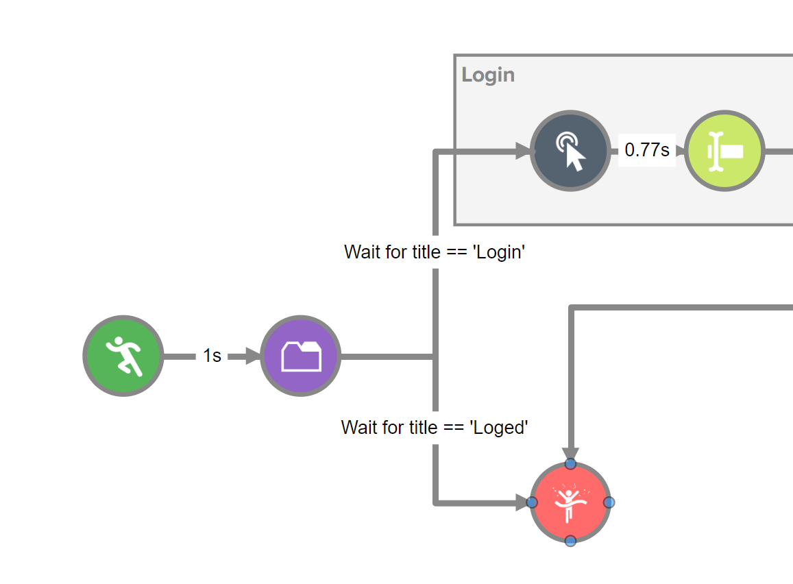

*This project is a fork of [iann0036/wildfire](https://github.com/iann0036/wildfire)*

This fork add this features:
- Update some code standards (a bit)*
- Add labels to array

Current contributors of this fork:
- *[@slavi010](https://github.com/slavi010)* - March 2023

# More information about Wildfire can be found on their website: [wildfire.ai](https://wildfire.ai/)

"Wildfire is an extension which allows you to record your actions on the pages you visit, then replay those actions using a simulator. When actions are recorded or simulated, it produces a log which can be reviewed. You can then use the Workflow Editor to manipulate the behavior of the simulation."